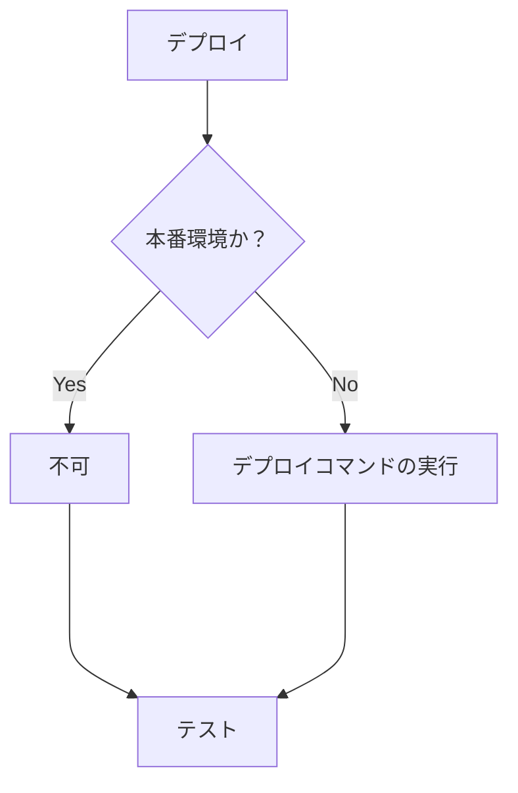
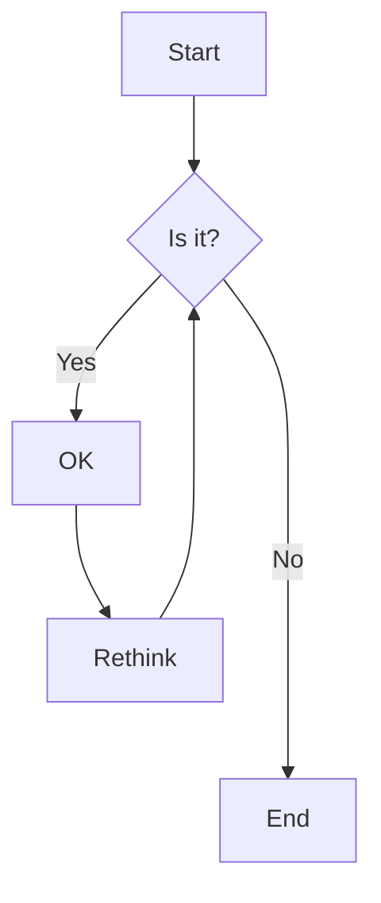
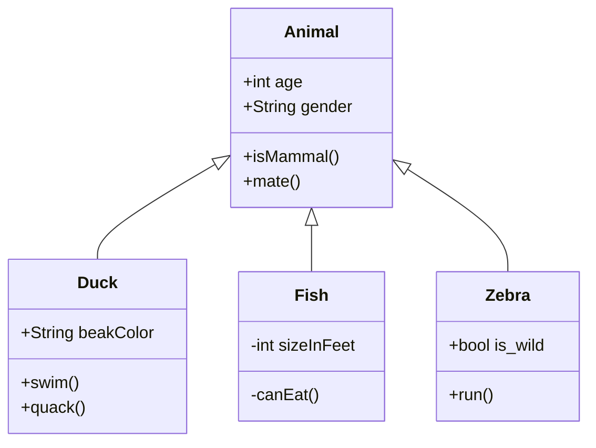

# Markdown Sample

## With Mermaid

### Java

```java
Class Sample {
    private String test;
    private String test1;

    public setTest(String test) {
        this.test = test;
    }

    public getTest() {
        return test;
    }
}
```

### Flowchart





### Graph


### Class Diagram


